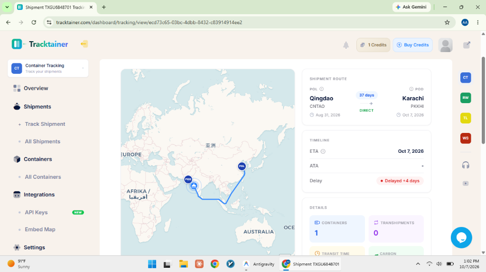

# Container Tracking (Tracktainer Mobile App)

A minimalist single-accent-color mobile shipment tracker inspired by the **Tracktainer** interface, integrated with Tracktainer API and synchronized with **Google Sheets**.

**Live Demo**: [https://ahmadok12.github.io/Container-Tracking/](https://ahmadok12.github.io/Container-Tracking/)



## 🌟 Features

- **Mobile-First Tracktainer UI**: Designed with Tracktainer's clean aesthetic, single accent color (`#0284c7`), and intuitive navigation.
- **Shipment Selection Screen**: Easily browse, search, and manage all shipments added to the portal.
- **Dedicated Tracking Dashboard**:
  - Live interactive AIS Maritime Ocean Route Map tracing voyage from POL (Port of Loading) to POD (Port of Discharge) with animated vessel markers.
  - Shipment Route Cards (`Qingdao → Karachi`), ETA, ATA, and delay indicators (`Delayed +4 days`).
  - Container counts, transhipment status, transit time, and estimated carbon emissions.
  - Chronological Milestones Table (`ACTUAL` vs `PLANNED` events, country flags, and vessel IMO/voyage info).
- **Update Shipment Status**: Quick 1-tap modal to update delay days, arrival estimates, and append new milestone events.
- **Tracktainer API Linking**: Native support for Tracktainer developer API keys and inbound status update webhooks.
- **Google Sheets Database**: Direct 2-way synchronization with Google Sheets using Google Apps Script Web App.

---

## 🚀 Quick Start

### 1. Installation
```bash
# Clone the repository
git clone https://github.com/ahmadok12/Container-Tracking.git
cd Container-Tracking

# Install dependencies
npm install
```

### 2. Environment Configuration
Copy `.env.example` to `.env`:
```bash
cp .env.example .env
```
Add your Tracktainer API Key in `.env`:
```env
PORT=3001
TRACKTAINER_API_KEY=ca0853e15f63f20e1f02bc87166ed103bdeab9db
TRACKTAINER_BASE_URL=https://api.tracktainer.com/v1
```

### 3. Run Development Server
```bash
npm run dev
```
- **Mobile Web App**: `http://localhost:5173`
- **Backend API**: `http://localhost:3001`

---

## 📊 Google Sheets Integration

1. Create a spreadsheet at [sheets.new](https://sheets.new).
2. Go to **Extensions → Apps Script**.
3. Copy and paste the script located in `server/data/googleAppsScript.js`.
4. Click **Deploy → New deployment** → Type: **Web app** → Execute as: **Me** → Access: **Anyone**.
5. Copy your Web App URL and paste it in the app's **Settings (Gear icon) → Google Sheets** tab.

---

## 🚢 Tracktainer API Integration

- Get your developer API key at [tracktainer.com/dashboard/integrations](https://tracktainer.com/dashboard/integrations).
- Enter the key in the mobile app settings or in `.env`.
- To receive automated carrier milestone events, set your Tracktainer Webhook URL to:
  `http://<your-server-domain>/api/tracktainer/webhook`

---

## 🛠 Tech Stack

- **Frontend**: React 19, Vite, Tailwind CSS, Leaflet, Lucide React
- **Backend**: Node.js, Express, CORS
- **Storage**: Google Sheets (via Apps Script Webhook API) & Local JSON cache
